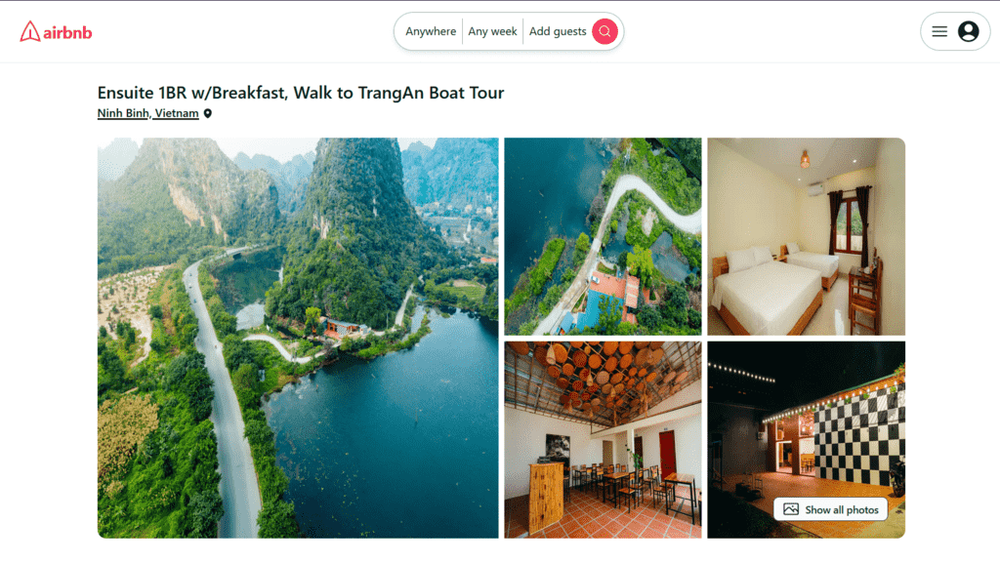
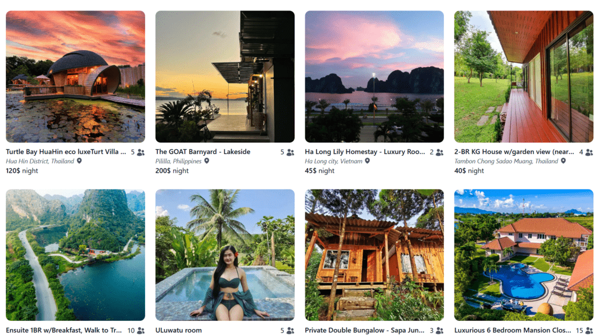

# Airbnb clone





MERN stack app

## Guide

1. Create airbnb-server/.env file with following content:

   ```
   MONGO_URL=<Your_MongoDB_URL>
   PORT=8080
   JWT=<Your_Secret_Key>
   ORIGIN="http://localhost:5173"
   ```

2. Install dependencies and run:

   Open Terminal

   ```
   cd airbnb-client
   npm install
   npm run dev
   ```

   Open new Terminal

   ```
   cd airbnb-server
   npm install
   npm run dev
   ```

---

Owned by: [Minh Dang](https://github.com/lenhutminhdang) (Github)
